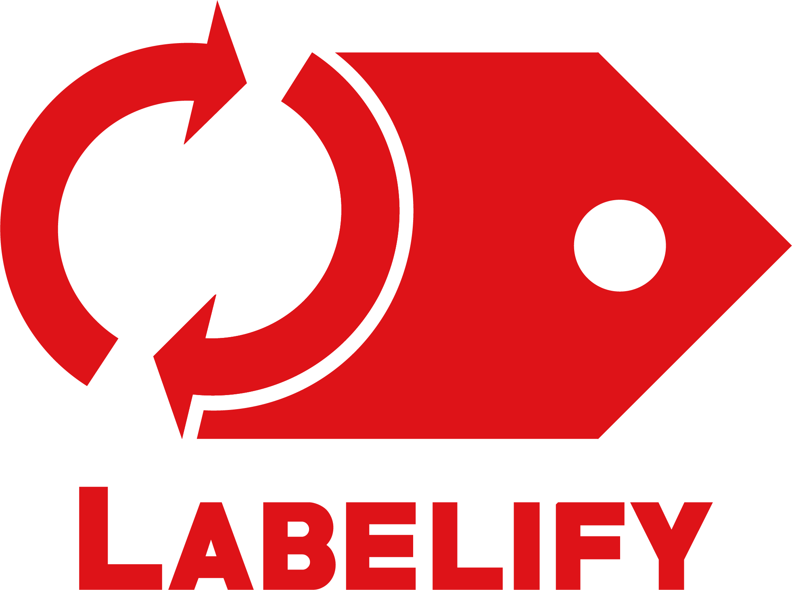

<!--lint disable no-html-->

<p align="center"></p>

<!--lint enable no-html-->

# labelify

[](https://www.npmjs.org/package/labelify)
[](https://travis-ci.org/itgalaxy/labelify)
[](https://david-dm.org/itgalaxy/labelify)
[](https://david-dm.org/itgalaxy/labelify?type=dev)
[](https://greenkeeper.io)

Automate and simplify the creation of labels for your GitHub/Github/Send_PR_For_You_Platform repository.

## Highlights

- Support configuration file.
- Support Github/Gitlab platforms (include self hosted solutions).
- CLI.
- Promise interface.
- Simple usage.

## Installation

```shell
npm i -D labelify
```

## Getting Started

1.  Create configuration file with your labels (add options if you need them) in root of your project.
    Recommended to create `labelify.config.js` file in root project directory or use `labelify` property in `package.json`.

    Example `labelify.config.js` file (basic `github` labels):

    ```js
    module.exports = {
      // You can use any config options here.
      // config: { overlap: true },
      labels: [
        {
          color: "#ee0701",
          name: "bug"
        },
        {
          color: "#cccccc",
          name: "duplicate"
        },
        {
          color: "#84b6eb",
          name: "enhancement"
        },
        {
          color: "#128A0C",
          name: "help wanted"
        },
        {
          color: "#e6e6e6",
          name: "invalid"
        },
        {
          color: "#cc317c",
          name: "question"
        },
        {
          color: "#ffffff",
          name: "wontfix"
        }
      ]
    };
    ```

2.  Add `labelify` command in `package.json`.

    ```json
    {
      "scripts": {
        "labelify": "labelify"
      }
    }
    ```

3.  Creating a personal access token for the command line

    - [github](https://help.github.com/articles/creating-a-personal-access-token-for-the-command-line/)
    - [gitlab](https://docs.gitlab.com/ee/user/profile/personal_access_tokens.html)

4.  Run npm script.

    NPM:

    ```shell
    TOKEN=YOUR_SECRET_TOKEN npm run labelify
    ```

    Yarn:

    ```shell
    TOKEN=YOUR_SECRET_TOKEN yarn labelify
    ```

## Configuration file

Configuration file contains:

- List of labels (**Required**).
- Config (**Optional**)

[Find and load a configuration object algorithm](https://github.com/davidtheclark/cosmiconfig#cosmiconfig).

Example configuration file:

**labelify.config.js**

```js
module.exports = {
  // You can use any config options here.
  config: {
    // overlap: true,
  },
  labels: [
    {
      color: "#111111",
      name: "1"
    },
    {
      color: "#222222",
      name: "2"
    },
    {
      color: "#333333",
      name: "3"
    }
  ]
};
```

### labels

List of labels. [label fields](https://github.com/itgalaxy/labelify#optionslabels).

### config

List of config options. [list config options](https://github.com/itgalaxy/labelify#optionsconfig).

### extends

Your configuration can extend an existing configuration (whether your own or a third-party config).
When one configuration extends another, it starts with the other's properties then adds to and overrides what's there.

Example:

```js
module.exports = {
  extends: "labelify-config-standard",
  labels: [
    {
      color: "#ffffff",
      name: "extended-label"
    }
  ]
};
```

## API

```js
const labelify = require("labelify");

const options = {
  // Looks on config options below
  config: {},
  // Looks on label fields below
  labels: [
    { color: "#aaa", name: "a" },
    { color: "#bbb", name: "b" },
    { color: "#ccc", name: "c" }
  ]
};

labelify(options)
  .then(result => console.log(result))
  .catch(error => console.log(error.stack));
```

---

### options.labels

Type: `Array`

Default: `[]`

Array of labels.

### List of label fields

#### name

**Required**

Type: `String`

Name of label.

#### color

**Required**

Type: `String`

Color of label. Support short (`#fff`) and long (`#ffffff`) hex notation.

#### description

**Optional**

Type: `String`

Description of label.

If you want remove priority for label use `null` value.

#### priority

**Optional**

Type: `Number`

Priority of label. Must be equal 0 or greater.

If you want remove priority for label use `null` value.

**Note:** works only for Gitlab platform.

---

### options.config

Type: `Object`

Default: `{}`

**Notes:**

- **`labelify` automatically resolve `platform` and `endpoint` options based on information in `package.json`.**
- **Use `platform` option only when you have self hosted solution.**
- **Use `endpoint` option only when you have nonstandard API URL fro your platform.**

#### overlap

Type: `Boolean`

Default: `false`

Removes all labels which are not in options/configuration from the repository.

#### platform

Type: `string`

Type of platform where your store repository.

Available configuration:

- github
- gitlab

#### endpoint

Type: `string`

Endpoint for your API.
Example for github it is `https://api.github.com/repos/itgalaxy/labelify/labels`.

#### api

Allow to pass own API. Should contain 4 method.
You can look on example API [here](./src/lib/api/github.js).

#### token

Type: `string`

Default: `process.env.TOKEN || process.env.GITHUB_TOKEN || process.env.GITLAB_TOKEN`

Access token for your repository.

**Note: store `token` in code or configuration file is insecurity**.

How to create token:

- [github](https://help.github.com/articles/creating-a-personal-access-token-for-the-command-line/)
- [gitlab](https://docs.gitlab.com/ee/user/profile/personal_access_tokens.html)

## CLI

```none
  Automate and simplify the creation of labels for your repository.

  Usage: labelify [options]

  Options:
    --config
      Path to a specific configuration file (JSON, YAML, or CommonJS), or the
      name of a module in node_modules that points to one. If no --config
      argument is provided, "labelify" will search for configuration files in
      the following places, in this order:
        - a labelify property in package.json
        - a .labelify file (with or without filename extension:
          .json, .yaml, .yml, and .js are available)
        - a labelify.config.js file exporting a JS object
      The search will begin in the working directory and move up the directory
      tree until a configuration file is found.

    --config-basedir
      An absolute path to the directory that relative paths defining "extends"
      are *relative to*. Only necessary if these values are relative paths.

    --overlap, -o
      Removes all labels which are not in configuration from the repository.

    --platform, -p
      Type of platform where your store repository.
      Use platform option only when you have self hosted solution.

    --endpoint, -e
      Endpoint for your API.
      Use endpoint option only when you have nonstandard API URL fro your platform.

    --version, -v
      Show the currently installed version of labelify.
```

Example usage:

```shell
TOKEN=YOUR_SECRET_TOKEN labelify
```

## Todo

PR welcome

- **medium** More tests.
- **low** Respect `x-ratelimit-remaining` and `x-ratelimit-reset` from `github`.
- **low** Support `bitbucket`.
- **low** Basic presets.
- **low** Integrate `ora` for better logging.

## Thanks

- [git-label](https://github.com/jasonbellamy/git-label) - inspiration and ideas.
- [got](https://github.com/sindresorhus/got) - for great library without `several megabytes`.
- the logo designed by [@reallinfo](https://github.com/reallinfo)

## Contribution

Feel free to push your code if you agree with publishing under the MIT license.

## [Changelog](CHANGELOG.md)

## [License](LICENSE)
